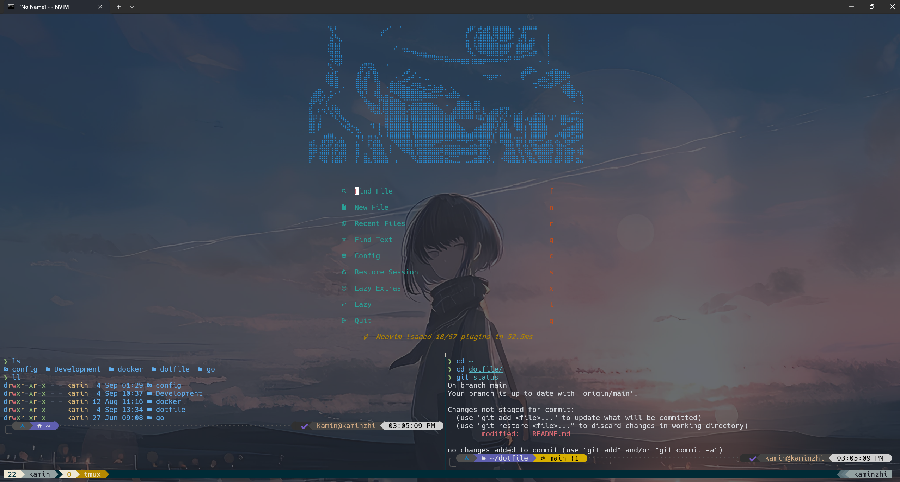

# Dev Dotfiles

#### My Neovim screenshot

## Contents

- [fish config](./.config/fish/)
- [neovim config](./.config/nvim/)
- [tmux config](./.config/tmux/)
- [kitty config](./.config/kitty/)

## Neovim setup

- [Dashboard-nvim](https://github.com/glepnir/dashboard-nvim)
- [toggleterm-nvim](https://github.com/akinsho/toggleterm.nvim)
- [Nvim-tree.lua](https://github.com/nvim-tree/nvim-tree.lua)

## Shell setup (Linux)

- [Kitty terminal](https://github.com/kovidgoyal/kitty)
- ~~[colorls](https://github.com/athityakumar/colorls)~~
- [Eza](https://github.com/eza-community/eza)
- [Fish shell](https://fishshell.com/)
- [Fisher](https://github.com/jorgebucaran/fisher)
- [Tide](https://github.com/IlanCosman/tide)
- [Nerd fonts(Hack)](https://github.com/ryanoasis/nerd-fonts)
- [fzf](https://github.com/PatrickF1/fzf.fish)

## Reference sources

- [craftzdog-solarized-osaka.nvim](https://github.com/craftzdog/solarized-osaka.nvim)
- [craftzdog-dotfiles-public](https://github.com/craftzdog/dotfiles-public)
- [gpakosz-.tmux](https://github.com/gpakosz/.tmux)
